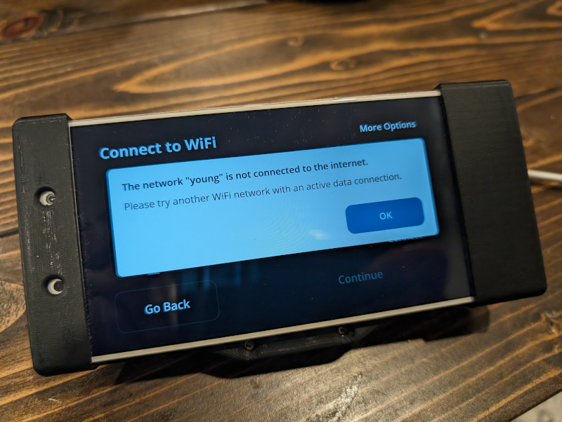

# neos-manual-install

> [!NOTE]
> This tool may have issues installing NEOS as OS update images are no longer hosted by comma.
>
> You may want to look into [ophwug/c2-neos-alt-fix-install](https://github.com/ophwug/c2-neos-alt-fix-install), a tool that is inspired by this repo which works around that issue and may be easier to run.

Stuck here? You're not alone.

This repo contains a downloadable, executable script that bypasses NEOS Setup to install openpilot. This appears to be necessary as of late February 2024; the reason is not yet understood. This script is made specifically for NEOS devices (EON, comma two). This is NOT designed or needed for AGNOS devices such as comma three or threex.

# Basic Usage

Installing stock openpilot 0.8.13.1.

1. Connect to Wi-Fi normally.
2. When connected, go to More Options.
3. Touch the triple-dot icon in the upper right corner, select Advanced.
4. Scroll down and note the IPv4 address, will look like "192.168.202.191".
5. Download and save the [NEOS default/setup SSH key](https://raw.githubusercontent.com/commaai/openpilot/master/system/hardware/tici/id_rsa) to your machine as "id_rsa".
    * This is different from any GitHub SSH key you may have.
    * You may need to right-click and choose "Save link as..."
6. Connect to your EON/C2 with SSH, using that key to authenticate.
    * No idea what SSH is? Watch [this video](https://www.youtube.com/watch?v=JHYbu50_uNE).
    * At a command line: `ssh -i [pathname of saved id_rsa] comma@[your-c2-ip-address]`
    * Your browser may have saved the id_rsa file as "id_rsa.txt" or "id_rsa.pem"
    * If you get a "bad permissions" error, fix permissions and try again:
        * Linux/WSL: `chmod 600 [pathname of saved id_rsa]`
        * Windows: Right-click on `id_rsa`, Properties, Security tab, remove the "Everyone" group if present
7. Once connected, paste this command into your SSH session.
    * `curl -Ls https://tinyurl.com/bdhse3xn | bash -s`

# Advanced Usage (Installing a Custom Fork)

Let's be honest, we're here because you were tempted to uninstall openpilot and try some other random fork!
The installer script in Step 7 above will accept two optional parameters, a GitHub repository owner and a branch name. This mirrors the format used by comma's install generator.

For a custom install URL such as: `installer.comma.ai/ErichMoraga/813`

Instead use this command: `curl -Ls https://tinyurl.com/bdhse3xn | bash -s ErichMoraga 813`
